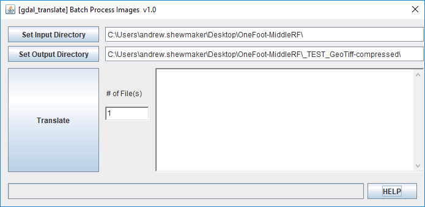
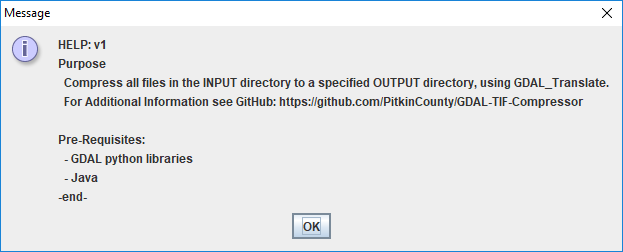

# GDAL-TIF-Compressor
This java desktop app iterates through an INPUT directory and compresses any TIF files into an OUTPUT directory using the python command 'gdal_translate'.

## Usage
Users can modify the following parameters within the GUI prior to clicking the **Translate** button:
* **Input Directory** - Where the uncompressed images can be found
* **Output Directory** - Where the compressed images should be sent
* **# of Files** - Max number of files to compress
  * If a positive integer (≥0), the app will exit after that # of files
  * NOTE: Output files that already exist do not count towards the number of files.

### ~~Set Input/Output Directory~~

* ~~Click the ‘Set Input Directory’ button, browse for the directory where **uncompressed image files** exist.~~

* ~~Click the ‘Set Output Directory’ button, browse for the directory where **compressed image files** should be written.~~

### ~~Review # of Files~~
~~If a positive integer (≥0) then the application will only compress the specified number of files, otherwise all files are processed. **NOTE**: Output files that already exist do not count towards the number of files.~~

### Click ‘Translate’
The ‘Translate’ button will be disabled while the task is running.
* The log will indicate what task it is starting.
* Feedback is logged for each file completed.
* Finally the word ‘Complete’ will indicate the task is finished, and the ‘Translate’ button will be re-enabled.
* Wait for completion

## Getting Started
GDAL is a library for reading and writing raster and vector geospatial data formats. This application loops through a user-defined input directory (non-recursive, optional: maximum number of files), calling ‘gdal_translate’ to compress each TIFF file into the specified output directory using the original filename. The GUI will be responsive while the command executes, which takes ~1 min per file and acheives ~95% compression.

A common use case for this application is for processing large image sets from a fly-over or reducing a TIFF file for public download (i.e. the Pitkin County GIS Department).

### Prerequisites / Minimum System Requirements:
* Geospatial Data Abstraction Library (GDAL)
* Python 2?
* Windows 7?

### Install / Run the Application
Make sure the system requirements have been met.

The Java Application is distributed as a JAR file 'GDAL_Translate.jar', which can be downloaded from this GitHub Repo. Windows users can download then double click this file to run the application.

## Release Process
The source code and compiled JAR executable for this project were checked into this GitHub Repo upon initial release, and will be updated as this documentation is complete.

Built with NetBeans IDE, the project can be ‘published’/’deployed’ by distributing the JAR file from the ../dist/ directory (or this GitHub Repo).

## Future Development
This section is used to document requests for additional features and/or bug fixes.
### * confirm that GDAL_Libraries are embeded in this .jar executable
* Recursive Option
* Review “file exists” logic. We could ask the user?
* Implement ‘Cancel’ functionality while loop is running
* Option to open output directory upon completion
* Add some compression statistics to Log
* When input directory is set, we can count number of TIFF files, then use that number to estimate total time required, and make decisions about warning the user

## ~~FAQ (and Test Cases)~~
* What if the ‘# of Files’ is not-numeric? A positive integer? Less than 0?
  * If any error is thrown trying to convert the ‘# of Files’ to an integer, a message is logged, the value will default to 1 file, and the translation is cancelled.
  * If a positive integer is entered, the maximum number of files to be processed is set to the value provided.
  * *WARNING* If an integer value of <= 0 is entered, the program will process ALL files. The user will not be prompted or warned, and this could take a considerable amount of time (at ~1 minute per TIF file).
* What happens if the output file already exists?
  * If the output file exists already, then the application will assume the compression has already been completed, and will skip this file.
  * Files that are found to already exist in the output directory DO NOT count towards the number of files converted.
* What happens if the input directory does not exist?
  * This is checked when the input directory is chosen from the folder browser dialog. It is also checked when the ‘translate’ button is clicked.
  * A message is logged to indicate that the input directory does not exist.
    * Example: Translate Failed: Invalid input directory, Dir = 'inputDir’
  * Translation is cancelled
* What happens if the output directory does not exist?
  * Currently the translation fails and throws an error. The GUI does not crash and can be triggered again.
  * What should happen: Create the directory, no message to user 
